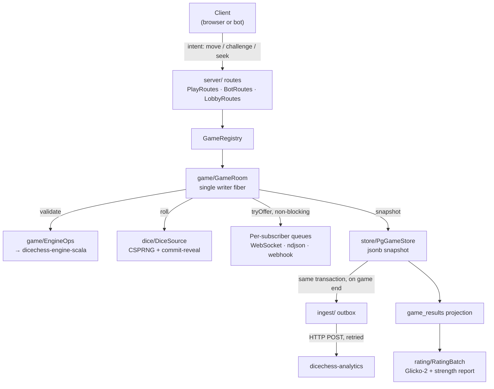

A single sbt module. The entry point is `dicechess.play.Main` (an `IOApp.Simple` serving Ember
on `0.0.0.0:8080`), which reads the environment and wires up the optional subsystems —
persistence, analytics ingest, the ladder scheduler, the rating batch, webhook push, and
retention. Each is opt-in; see [Configuration](/dicechess-play-api/configuration/).

## Package map

Everything lives under `src/main/scala/dicechess/play/`.

| Package | Owns |
| --- | --- |
| `core/` | Domain types with no dependencies: `Protocol`, `Identity` (Seat / Principal), `GameId`, `Seek`, `BotEvent` |
| `dice/` | `DiceSource` — server-only CSPRNG dice with commit-reveal fairness |
| `game/` | `GameRoom` (the actor-style room), `EngineOps` (the only engine wrapper), `PlayerConnection` |
| `server/` | http4s routes and the services behind them — the largest package |
| `store/` | `GameStore` / `PgGameStore` (doobie + Flyway), `GameArchive`, `Retention` |
| `rating/` | `Glicko2`, `RatingBatch`, and the strength report: `Sprt`, `BradleyTerry`, `StrengthReport`, `StrengthCache` |
| `ingest/` | `PlaysiteIngest` + `IngestDeliverer` — the transactional outbox to analytics |
| `wire/` | `Codecs.scala` — the Circe codecs that *are* the client wire contract |

## How a move travels

The shape to hold on to: **the room is the only writer of game state**, and everything
downstream of it — subscribers, snapshots, the outbox — is fed without ever letting a slow
consumer block play. That rule is spelled out in
[Concurrency Doctrine](/dicechess-play-api/concurrency/).

## Cross-repository contracts

`play-api` sits in the middle of four contracts. Changing either side of one without the other
is the most common way to break the platform.

- **Consumes** `lv.id.jc:dicechess-engine-scala`, a JVM artifact from GitHub Packages with the
  version pinned in `build.sbt`. It is the single source of truth for the rules — legality is
  never reimplemented here. Legal moves ship on the wire as a prefix tree of UCI micro-moves.
- **Publishes** the client wire protocol in `wire/Codecs.scala`, consumed by the
  `dicechess-play` SvelteKit front end. Both sides must be verified together.
- **Publishes** the analytics ingest payload built in `ingest/PlaysiteIngest.scala` — posted to
  the analytics service's `/api/games` with `source=playsite`, idempotent, first writer wins.
- **Publishes** the public Bot API, documented at [bots.jc.id.lv](https://bots.jc.id.lv/). Its
  machine-readable contracts (`openapi.yaml`, `asyncapi.yaml`) live in that site's `public/`
  directory and are rendered into the reference at build time, so the spec cannot drift
  silently from the docs.

## HTTP surface

Routes are grouped by audience rather than by resource:

- **Operational** — `GET /health`, `GET /version`.
- **Human game surface** — `POST /games`, `GET /games/{id}`, `GET /games/{id}/ws?token=…`.
- **Public discovery** — `GET /games`, `GET /leaderboard`, `GET /bots/{team}/{name}`, plus the
  history and strength endpoints.
- **Bot API** — everything under `/bot/…`: identity, challenges, seeks, gameplay, streams,
  webhooks, ladder.

The complete, authoritative reference for the bot-facing routes is the
[Bot API site](https://bots.jc.id.lv/), not this page.
