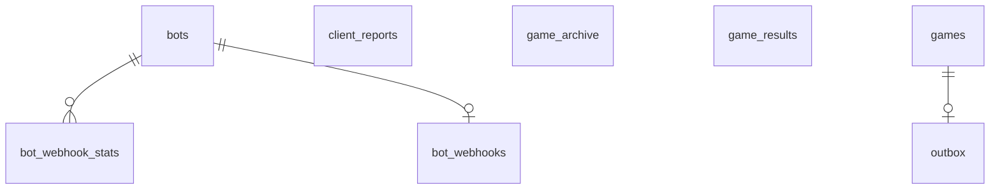

<!--
  GENERATED FILE — do not edit by hand.
  Produced by scripts/generate-schema-docs.sh from the Flyway migrations in
  src/main/resources/db/migration/. Run `mise run contrib-docs:schema` after adding a
  migration; CI regenerates this file and fails if the committed copy differs.

  This is an HTML comment, not an MDX one: the page is .md, where {/* … */} renders as
  literal text on the page.
-->

:::note[Generated from the migrations]
This page is derived by applying every Flyway migration to a real Postgres and introspecting
the result, so it cannot drift from the code. It is the *what*; the
[Database Schema](/dicechess-play-api/database/) page is the *why* — read that one first.

Regenerate with `mise run contrib-docs:schema` after adding a migration.
:::

## Entity relationships

Only foreign keys appear as edges. Three tables carry no foreign key on purpose —
`game_results` and `game_archive` must outlive the snapshots they describe, and
`client_reports` holds browser-submitted reports for games that never had a
`games` row on this server (kept separate from authoritative game data by design).

## Tables

### `bot_webhook_stats`

| Column | Type | Null | Default | Key |
| --- | --- | --- | --- | --- |
| `team` | `text` | no | — | FK → bots(team, name), PK |
| `name` | `text` | no | — | FK → bots(team, name), PK |
| `hour` | `timestamp with time zone` | no | — | PK |
| `outcome` | `text` | no | — | PK |
| `latency_bucket` | `smallint` | no | — | PK |
| `count` | `bigint` | no | `0` | — |

Indexes:

- `bot_webhook_stats_pkey` — `CREATE UNIQUE INDEX bot_webhook_stats_pkey ON public.bot_webhook_stats USING btree (team, name, hour, outcome, latency_bucket)`
- `bot_webhook_stats_recent_idx` — `CREATE INDEX bot_webhook_stats_recent_idx ON public.bot_webhook_stats USING btree (team, name, hour)`

### `bot_webhooks`

| Column | Type | Null | Default | Key |
| --- | --- | --- | --- | --- |
| `team` | `text` | no | — | FK → bots(team, name), PK |
| `name` | `text` | no | — | FK → bots(team, name), PK |
| `url` | `text` | no | — | — |
| `secret` | `text` | no | — | — |
| `verified_at` | `timestamp with time zone` | no | — | — |
| `created_at` | `timestamp with time zone` | no | `now()` | — |
| `last_failure_at` | `timestamp with time zone` | yes | — | — |
| `last_failure_reason` | `text` | yes | — | — |

Indexes:

- `bot_webhooks_pkey` — `CREATE UNIQUE INDEX bot_webhooks_pkey ON public.bot_webhooks USING btree (team, name)`

### `bots`

| Column | Type | Null | Default | Key |
| --- | --- | --- | --- | --- |
| `team` | `text` | no | — | PK |
| `name` | `text` | no | — | PK |
| `token_hash` | `text` | no | — | unique |
| `created_at` | `timestamp with time zone` | no | `now()` | — |
| `rotated_at` | `timestamp with time zone` | yes | — | — |
| `glicko_rating` | `double precision` | no | `1500` | — |
| `glicko_rd` | `double precision` | no | `350` | — |
| `glicko_vol` | `double precision` | no | `0.06` | — |
| `on_ladder` | `boolean` | no | `false` | — |
| `owner_external_id` | `text` | yes | — | — |
| `open_to_humans` | `boolean` | no | `false` | — |
| `description` | `text` | yes | — | — |
| `max_concurrent_games` | `integer` | no | `1` | — |

Check constraints:

- `CHECK (((max_concurrent_games >= 1) AND (max_concurrent_games <= 32)))`

Indexes:

- `bots_pkey` — `CREATE UNIQUE INDEX bots_pkey ON public.bots USING btree (team, name)`
- `bots_token_hash_key` — `CREATE UNIQUE INDEX bots_token_hash_key ON public.bots USING btree (token_hash)`

### `client_reports`

| Column | Type | Null | Default | Key |
| --- | --- | --- | --- | --- |
| `report_id` | `uuid` | no | — | PK |
| `payload` | `jsonb` | no | — | — |
| `attempts` | `integer` | no | `0` | — |
| `next_attempt_at` | `timestamp with time zone` | no | `now()` | — |
| `failed_permanently` | `boolean` | no | `false` | — |
| `last_error` | `text` | yes | — | — |
| `created_at` | `timestamp with time zone` | no | `now()` | — |
| `delivered_at` | `timestamp with time zone` | yes | — | — |

Indexes:

- `client_reports_due_idx` — `CREATE INDEX client_reports_due_idx ON public.client_reports USING btree (next_attempt_at) WHERE ((delivered_at IS NULL) AND (NOT failed_permanently))`
- `client_reports_pkey` — `CREATE UNIQUE INDEX client_reports_pkey ON public.client_reports USING btree (report_id)`

### `game_archive`

| Column | Type | Null | Default | Key |
| --- | --- | --- | --- | --- |
| `game_id` | `uuid` | no | — | PK |
| `payload` | `jsonb` | no | — | — |
| `finished_at` | `timestamp with time zone` | no | `now()` | — |

Indexes:

- `game_archive_pkey` — `CREATE UNIQUE INDEX game_archive_pkey ON public.game_archive USING btree (game_id)`

### `game_results`

| Column | Type | Null | Default | Key |
| --- | --- | --- | --- | --- |
| `game_id` | `uuid` | no | — | PK |
| `white_external_id` | `text` | no | — | — |
| `black_external_id` | `text` | no | — | — |
| `result` | `smallint` | yes | — | — |
| `termination` | `text` | no | — | — |
| `rated` | `boolean` | no | — | — |
| `time_control` | `text` | no | — | — |
| `server_seed` | `text` | no | — | — |
| `pairing_id` | `uuid` | yes | — | — |
| `finished_at` | `timestamp with time zone` | no | `now()` | — |
| `rating_applied_at` | `timestamp with time zone` | yes | — | — |
| `ladder` | `boolean` | no | `false` | — |

Indexes:

- `game_results_black_finished_idx` — `CREATE INDEX game_results_black_finished_idx ON public.game_results USING btree (black_external_id, finished_at DESC)`
- `game_results_ladder_idx` — `CREATE INDEX game_results_ladder_idx ON public.game_results USING btree (ladder) WHERE ladder`
- `game_results_pairing_idx` — `CREATE INDEX game_results_pairing_idx ON public.game_results USING btree (pairing_id) WHERE (pairing_id IS NOT NULL)`
- `game_results_pkey` — `CREATE UNIQUE INDEX game_results_pkey ON public.game_results USING btree (game_id)`
- `game_results_rated_finished_idx` — `CREATE INDEX game_results_rated_finished_idx ON public.game_results USING btree (rated, finished_at)`
- `game_results_rating_queue_idx` — `CREATE INDEX game_results_rating_queue_idx ON public.game_results USING btree (finished_at) WHERE (rated AND (rating_applied_at IS NULL))`
- `game_results_white_finished_idx` — `CREATE INDEX game_results_white_finished_idx ON public.game_results USING btree (white_external_id, finished_at DESC)`

### `games`

| Column | Type | Null | Default | Key |
| --- | --- | --- | --- | --- |
| `id` | `uuid` | no | — | PK |
| `status` | `text` | no | — | — |
| `snapshot` | `jsonb` | no | — | — |
| `created_at` | `timestamp with time zone` | no | `now()` | — |
| `updated_at` | `timestamp with time zone` | no | `now()` | — |

Check constraints:

- `CHECK ((status = ANY (ARRAY['active'::text, 'ended'::text])))`

Indexes:

- `games_active_idx` — `CREATE INDEX games_active_idx ON public.games USING btree (status) WHERE (status = 'active'::text)`
- `games_pkey` — `CREATE UNIQUE INDEX games_pkey ON public.games USING btree (id)`

### `outbox`

| Column | Type | Null | Default | Key |
| --- | --- | --- | --- | --- |
| `game_id` | `uuid` | no | — | FK → games(id), PK |
| `payload` | `jsonb` | no | — | — |
| `attempts` | `integer` | no | `0` | — |
| `next_attempt_at` | `timestamp with time zone` | no | `now()` | — |
| `failed_permanently` | `boolean` | no | `false` | — |
| `last_error` | `text` | yes | — | — |
| `created_at` | `timestamp with time zone` | no | `now()` | — |
| `delivered_at` | `timestamp with time zone` | yes | — | — |

Indexes:

- `outbox_due_idx` — `CREATE INDEX outbox_due_idx ON public.outbox USING btree (next_attempt_at) WHERE ((delivered_at IS NULL) AND (NOT failed_permanently))`
- `outbox_pkey` — `CREATE UNIQUE INDEX outbox_pkey ON public.outbox USING btree (game_id)`
