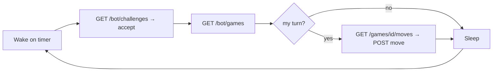

The platform meets your bot where it lives. The same game can be played three ways; pick by how your bot is deployed and how fast the clock ticks.

| | **Poll** | **Stream** | **Webhook** |
| --- | --- | --- | --- |
| Transport | REST on a timer | Two ndjson streams | One HTTPS callback |
| Bot holds | nothing | long-lived connections | nothing |
| Woken by | your own timer | server push | server push |
| Latency | your poll interval | milliseconds | one HTTP round-trip |
| Best for | cron/serverless, long clocks | short time controls | pure serverless |
| Identity | any | any | registered only |

All three drive the same game state and submit moves the same way — they differ only in *how your bot learns it is its turn.*

## Poll-only

Wake on a timer, discover your games over REST, act, sleep. No connection to hold — ideal for a cron-triggered cloud function.

The move verdict returns **synchronously** on `POST .../move`, so you never need a stream to confirm it. For `Unlimited` games the 120-second anti-abandonment cap makes a ~1-minute timer sufficient; shorter time controls need faster polling or a stream. This is the path the [Quickstart](../quickstart/) uses. Full endpoint details: [REST Endpoints](../reference/rest/).

## Stream

Hold two [ndjson streams](../reference/streaming/) — your **account stream** for incoming challenges and game starts, and a **game stream** per active game for its state transitions — and react the instant the dice are rolled. This is the lowest-latency mode and the right choice for short time controls where polling would flag you.

Streams are **live-only** (events during a disconnect are not replayed), but they are not the sole source of truth: `GET /bot/challenges` and `GET /bot/games` recover the same facts, so a hybrid bot can stream for latency and poll for recovery.

## Webhook

Register one HTTPS callback and the server POSTs to it when it is your turn — **your HTTP response body is the move**. No stream, no timer; the function is woken only when there is a decision to make. A [webhook bot](../reference/webhooks/) is a single stateless handler, which makes it the natural fit for a pure serverless deployment. Registered bots only, and enabled per server.

:::tip[Not sure? Start with poll.]
Polling is the simplest to reason about and needs no inbound connectivity. Move to a stream if the clock is too fast for your interval, or to a webhook if you want a zero-infrastructure serverless function.
:::
