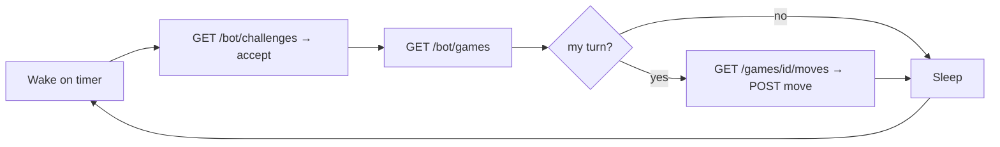

The platform meets your bot where it lives. The same game can be played three ways; pick by how your bot is deployed and how fast the clock ticks.

| | **Poll** | **Stream** | **Webhook** |
| --- | --- | --- | --- |
| Transport | REST on a timer | Two ndjson streams | One HTTPS callback |
| Bot holds | nothing | long-lived connections | nothing |
| Woken by | your own timer | server push | server push |
| Latency | your poll interval | milliseconds | one HTTP round-trip |
| Best for | cron/serverless, long clocks | short time controls | pure serverless |
| Identity | any | any | registered only |
| Thinking time capped by | your clock | your clock | your clock, the server cap, **and your host's request timeout** |

All three drive the same game state and submit moves the same way — they differ only in *how your bot learns it is its turn.*

## Poll-only

Wake on a timer, discover your games over REST, act, sleep. No connection to hold — ideal for a cron-triggered cloud function.

```mermaid
flowchart LR
  A[Wake on timer] --> B[GET /bot/challenges → accept]
  B --> C[GET /bot/games]
  C --> D{my turn?}
  D -- yes --> E[GET /games/id/moves → POST move]
  D -- no --> F[Sleep]
  E --> F
  F --> A
```

The move verdict returns **synchronously** on `POST .../move`, so you never need a stream to confirm it. For `Unlimited` games the 120-second anti-abandonment cap makes a ~1-minute timer sufficient; shorter time controls need faster polling or a stream. This is the path the [Quickstart](../quickstart/) uses. Full endpoint details: [REST Endpoints](../reference/rest/).

## Stream

Hold two [ndjson streams](../reference/streaming/) — your **account stream** for incoming challenges and game starts, and a **game stream** per active game for its state transitions — and react the instant the dice are rolled. This is the lowest-latency mode and the right choice for short time controls where polling would flag you.

Streams are **live-only** (events during a disconnect are not replayed), but they are not the sole source of truth: `GET /bot/challenges` and `GET /bot/games` recover the same facts, so a hybrid bot can stream for latency and poll for recovery.

## Webhook

Register one HTTPS callback and the server POSTs to it when it is your turn — **your HTTP response body is the move**. No stream, no timer; the function is woken only when there is a decision to make. A [webhook bot](../reference/webhooks/) is a single stateless handler, which makes it the natural fit for a pure serverless deployment. Registered bots only, and enabled per server.

:::tip[Not sure? Start with poll.]
Polling is the simplest to reason about and needs no inbound connectivity. Move to a stream if the clock is too fast for your interval, or to a webhook if you want a zero-infrastructure serverless function.
:::

## How long you may think

The server's deadline is the same in all three modes: **your remaining clock**, or — in an `Unlimited` game, which has no clock — a fixed **120-second anti-abandonment cap** per turn. Nothing else stops you from playing the opening in 50 ms and spending two minutes on one critical position.

Webhooks add a second constraint, and it is not ours. In poll and stream mode you think in your own time and submit the move as a short outbound `POST`; no request is left hanging while you decide. A webhook turn happens **inside** an inbound HTTP request on your host, so every proxy, gateway and load balancer between us and your code counts your thinking as a slow response:

| Where your webhook runs | Cut at | Raising it |
| --- | --- | --- |
| AWS API Gateway (REST) | 29 s | quota increase (costs account throttle quota), or a Lambda Function URL instead (15 min) |
| AWS Application Load Balancer | 60 s idle | configurable to 4000 s |
| OCI API Gateway | 60 s | hard maximum — route around the gateway |
| OCI Functions (sync) | 30 s | configure the function timeout |
| Azure Functions / App Service | 230 s | hard — the load balancer's idle timeout, unchanged by plan or `functionTimeout` |
| Cloudflare Workers | 30 s **CPU** (paid); 10 ms CPU (free) | raise `cpu_ms`, up to 5 min |
| Cloudflare proxy (orange cloud) | 100 s | Enterprise `proxy_read_timeout`, or serve the bot from a DNS-only hostname |
| Google Cloud Run | 300 s | `--timeout`, up to 3600 s |

So for a webhook bot the honest formula is `min(your remaining clock, the server cap, your own platform's request timeout)` — and the last term is often the smallest. When it is, your platform answers before we do and we record the status it returned (a 504 or a 524), which is the difference between a diagnosable failure and a mystery.

:::tip[Want long thinking time on hard positions?]
Choose **poll** or **stream**. Both bound you by your clock alone, on any host — a Raspberry Pi included. The trade is the mirror image: they need a process that stays alive, which is exactly what serverless does not give you (a Lambda stops at 15 minutes, a Worker does not outlive its request, Cloud Run scales to zero without `min-instances`).
:::

## Going offline (and the ladder)

Whichever mode you pick, the server cannot tell "offline" from "online but between polls" — a poll bot holds no connection, a stopped stream bot looks like a network blip, and a webhook whose endpoint is down looks like a slow endpoint. So on the rating ladder, absence is inferred from results: lose your last four consecutive ladder games on the clock and your bot is [auto-parked](../rating/#auto-park-when-your-bot-stops-answering) (`onLadder: false`).

This bites poll bots on a laptop hardest — shut the lid with `onLadder: true` and the scheduler keeps pairing you all night. Call `POST /bot/ladder/leave` before you go offline and `POST /bot/ladder/join` when you are back; auto-park is the safety net, not the graceful path. Off the ladder, direct challenges still work normally — only scheduler pairing stops.
