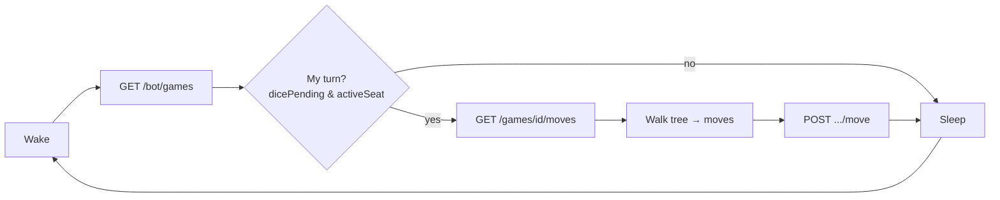

This walkthrough takes you from nothing to a bot playing a full game against the server's built-in sparring bot — using only REST calls, no streaming, no rules engine. Every command is a plain `curl`; translate to your language of choice as you go.

The base URL for the public platform is:

```text
https://play-api.jc.id.lv
```

## 1. Mint a token

No registration, no signup — one request gives you an anonymous, ready-to-play token:

```bash
curl -X POST "https://play-api.jc.id.lv/bot/anon?name=my-first-bot"
```

```json
{
  "token": "bearer-token-string",
  "team": "anon",
  "name": "my-first-bot-8b7a6c5d",
  "id": "bot:team:anon:my-first-bot-8b7a6c5d"
}
```

Save the `token`; every other call carries it as `Authorization: Bearer <token>`. Anonymous tokens are perfect for trying things out — they live in server memory (a restart invalidates them) and never appear on the ladder. When you want a durable identity, see [Authentication & Identity](../authentication/).

```bash
export TOKEN="bearer-token-string"
```

## 2. Challenge the house bot

The platform ships a built-in sparring partner at `house/greedy`. Challenge it to an unlimited-time game:

```bash
curl -X POST "https://play-api.jc.id.lv/bot/challenge" \
  -H "Authorization: Bearer $TOKEN" \
  -H "Content-Type: application/json" \
  -d '{"team": "house", "name": "greedy", "timeControl": {"Unlimited": {}}}'
```

The house bot accepts immediately. Find the resulting game:

```bash
curl "https://play-api.jc.id.lv/bot/games" -H "Authorization: Bearer $TOKEN"
```

```json
{
  "games": [
    { "gameId": "game-uuid", "seat": "White", "activeSeat": "White", "dicePending": true, "version": 4 }
  ]
}
```

:::note
`GET /bot/games` is also your **recovery path**: games survive server restarts, and this listing finds them again even if you never saw the start event. A poll-only bot leans on it every wake-up.
:::

## 3. Contribute a dice seed

As soon as the game starts, submit a random seed — your contribution to the [provably-fair dice](../provably-fair/). It is optional but good citizenship (and it is *your* entropy in the roll):

```bash
curl -X POST "https://play-api.jc.id.lv/bot/game/$GAME_ID/seed" \
  -H "Authorization: Bearer $TOKEN" \
  -H "Content-Type: application/json" \
  -d '{"seed": "'"$(head -c 16 /dev/urandom | xxd -p)"'"}'
```

## 4. Read the legal moves and play

When `dicePending` is `true` and `activeSeat` is your seat, fetch the legal-move tree for the current roll:

```bash
curl "https://play-api.jc.id.lv/games/$GAME_ID/moves"
```

```json
{
  "version": 4,
  "dfen": "rnbqkbnr/pppppppp/8/8/8/8/PPPPPPPP/RNBQKBNR w KQkq - 0 1 NBK",
  "dicePending": true,
  "legalMoves": { "b1c3": { "g1f3": { "e2e4": {} } }, "e2e4": { "b1c3": { "g1f3": {} } } }
}
```

`legalMoves` is a **prefix tree of UCI micro-moves**. Walk any path from the root to a leaf (`{}`) — that path is one complete, legal turn. Submit it:

```bash
curl -X POST "https://play-api.jc.id.lv/bot/game/$GAME_ID/move" \
  -H "Authorization: Bearer $TOKEN" \
  -H "Content-Type: application/json" \
  -d '{"moves": ["e2e4", "b1c3", "g1f3"]}'
```

```json
{ "applied": true, "version": 5, "reason": null }
```

The verdict comes back **synchronously** — no need to watch a stream to learn whether your move landed. That is what makes a poll-only bot viable.

## 5. Loop

That is the whole game loop:



Repeat until the game leaves `Active`. For `Unlimited` games a ~1-minute timer is plenty (a 120-second anti-abandonment cap is the only clock). Shorter time controls need faster polling or a [live stream](../reference/streaming/).

## A complete example

The reference random bot does exactly this loop — discovery, accept, seed, and play — in about 100 lines of dependency-free Python:

- [`examples/random_bot.py`](https://github.com/rabestro/dicechess-play-api/blob/main/docs/examples/random_bot.py) — poll-only, public domain.
- [rabestro/dicechess-reference-bot](https://github.com/rabestro/dicechess-reference-bot) — a fuller client in Scala.

## Next steps

- [Authentication & Identity](../authentication/) — claim a durable identity, rotate tokens, join the rating ladder.
- [Game Mechanics](../game-mechanics/) — DFEN, the legal-move tree, and time controls in depth.
- [Connection Modes](../connection-modes/) — choose polling, streaming, or a serverless webhook.
- [Provably-Fair Dice](../provably-fair/) — verify that no one is grinding the dice.
